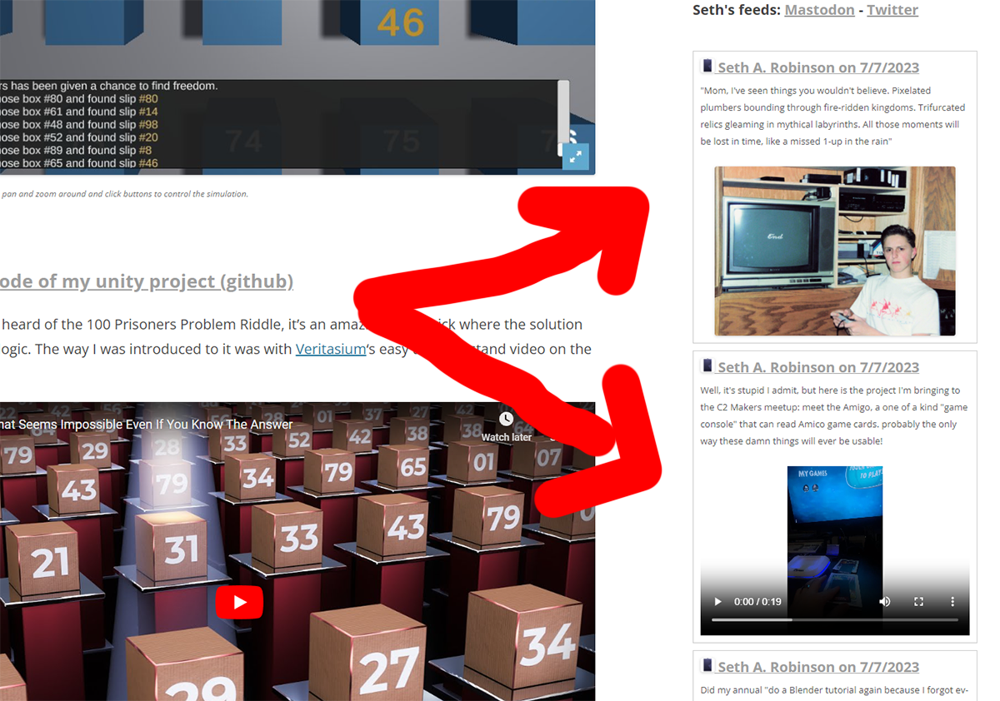
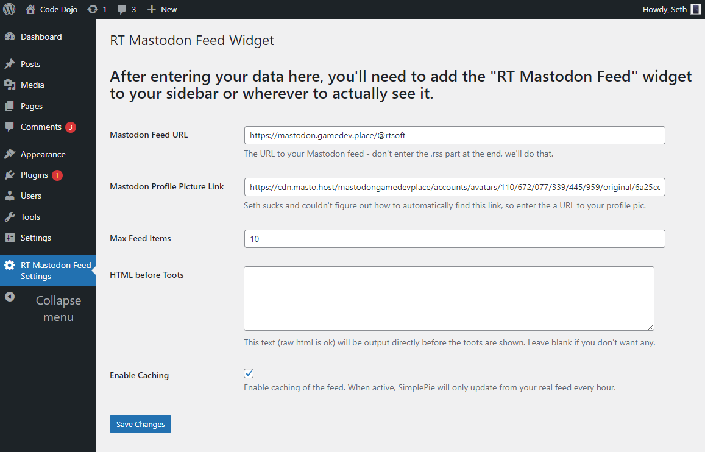

# rt-mastodon-feed
A simple widget for Wordpress that displays a Mastodon feed. Uses SimplePie.

## Features

* Super simple, easy to modify
* If caching is enabled, the feed is process only every hour instead of every time
* Supports images and movies

## Real world examples

Visit [codedojo.com]() or [c2kyoto.com]() to see it in action.  You can also remove the wordpress specific stuff, hardcode the feed url and use it on a [regular webpage](rtsoft.com) too.  

## Installation

* First, [download SimplePie](https://simplepie.org/wiki/setup/setup) and [install it](https://simplepie.org/wiki/setup/setup).  It's pretty simple.  It's a php thingie that can download and process rss feeds as well as cache them and required for this widget
* Put the entire rt-mastodon-feed folder in your wordpress *wp-content/plugins* directory.
* In the Wordpress Plugins menu, click "Enable" on the plugin.  If SimplePie isn't installed, it will tell you.
* On The Wordpress Dashboard, look for a new "RT Mastodon Feed Settings" option.  Click that and fill in the info.
* Add the RT Mastodon Feed widget to your sidebar using Wordpress' customize menu.

That's it!

## Known Issues and warnings

- It downloads any movies completely even if you haven't clicked them.  I chose to do it this way but others may disagree due to bandwith concerns (there's no way to easily get a thumbnail of a movie via mastodon, is there?)
- Movies are just white until you click the play button on iOS Safari, not sure why (help obi-wan css master)
- For some reason I had trouble grabbing the feed avatar automatically so I force you to manually put in the URL to it.  If you right click your avatar and view image, that link should work I guess
- If you want to customize the css, it's located inside the main .php file because Seth is lazy
- I've barely used it, so who knows what won't work, for example I should really see what it does with re-toots or whatever you call them over there

## Patches/fixes appreciated!
